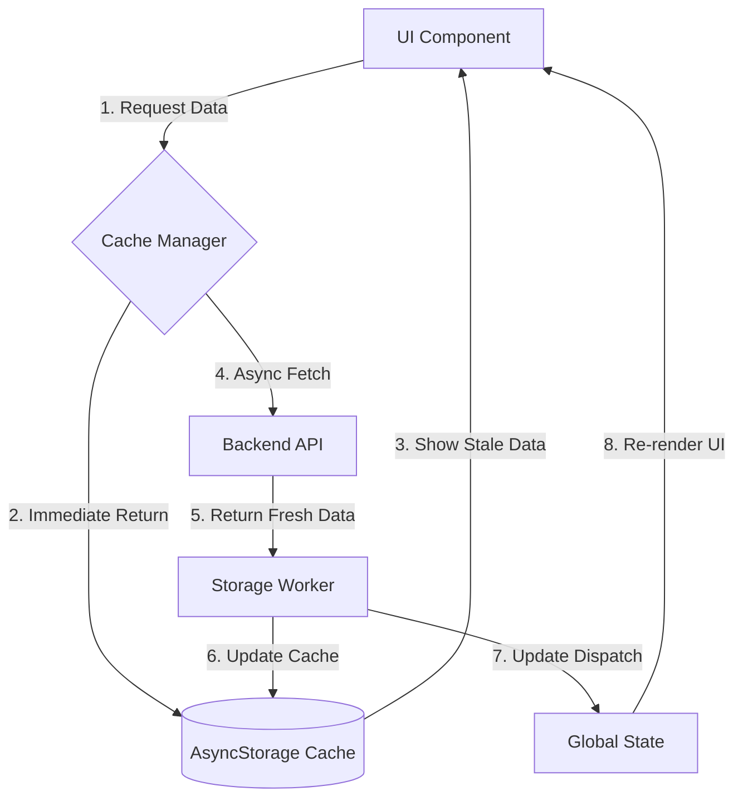

# Caching Strategy - ARDMS App

ARDMS App employs a robust multi-layered caching system designed to provide a "zero-latency" feel, especially in the messaging and chat modules. This strategy ensures that users can view their last-known state immediately upon opening the app, regardless of network conditions.

## 🏹 Primary Objectives

- **Instant Loading**: Display cached data immediately while fetching updates in the background.
- **Offline Resilience**: Allow users to read previously loaded messages and content without a network connection.
- **Reduced Data Usage**: Minimize redundant API calls by persisting state locally.
- **Smooth UX**: Eliminate flickering or empty states by using intelligent fallback mechanisms.

## 🏗️ Architecture

The caching layer is built on top of `AsyncStorage` for persistence and `React Context` / `Redux` for in-memory state management.

## 📦 Implementation Details

### 1. Conversation & User Caching
In the `MessagesScreen`, conversation lists and active users are persisted globally.
- **Key**: `cached_conversations_{userId}`, `cached_active_users_{userId}`
- **Storage**: `AsyncStorage`
- **Logic**: On mount, the app checks for cached users and populates the Redux state immediately.

### 2. Individual Chat Persistence
For messages within a specific chat (`/chat/[id]`), the system caches the most recent messages.
- **Key**: `cached_messages_{userId}_{chatId}`
- **Limit**: Caches the most recent 50 messages per conversation.
- **Timestamp Awareness**: Date objects are serialized/deserialized to ensure consistent formatting.

### 3. Media & File Caching
In the `ChatInfoScreen`, the lists of shared media, files, and links are cached.
- **Key**: `cached_chat_info_{userId}_{chatId}`
- **Data Structure**: Persists processed structures of links, media items, and file references.

## 🛠️ Components & Tools

### `messageStorage.ts`
The central utility for managing serialized data in `AsyncStorage`. It provides unified methods for:
- `saveConversations` / `getConversations`
- `saveMessages` / `getMessages`
- `saveChatInfo` / `getChatInfo`
- `clearUserCache`: Safely removes all user-related data on logout.

### `messageService.ts`
The service layer wraps API calls with caching logic:
1. Attempts API call.
2. On success: Updates local cache.
3. On failure: Falls back to cached data from `messageStorage`.

## 🔄 Lifecycle Handling

| Action | Cache Behavior |
| :--- | :--- |
| **App Launch** | Loads global conversation cache. |
| **Opening Chat** | Prioritizes local message cache before fetching. |
| **New Message** | Appends to memory and updates storage immediately. |
| **Pagination** | Freshly fetched pages update the primary cache. |
| **Logout** | Entire user cache is purged for security. |

## 🧪 Best Practices
- **Never Block**: Data loading from cache must never block the UI thread.
- **Silently Refresh**: Background updates should occur without intrusive loading indicators if cache exists.
- **Type Safety**: All cached data is validated against `@/@types/screens/messages` interfaces.
